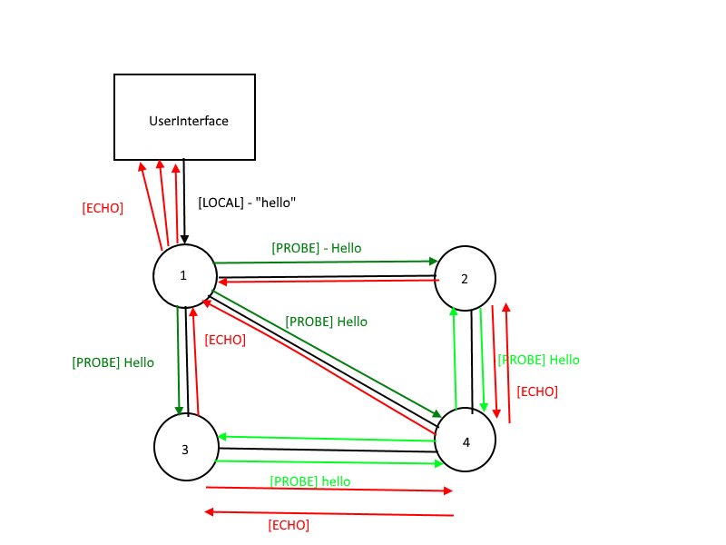

# distributed-architecture-probe-echos
## Henrik Akesson & Fabien Salathe

### About this program
This program is used to diffuse messages between nodes in a graph. A user interfacing class is used so that
the user can enter a message that will then be sent to its associated node.
The graph topology is:

|node 0|node 1|node 2|node 3|
|:---:|:---:|:---:|:---:|
|0|1|1|1|
|1|0|1|0|
|1|1|0|1|
|1|0|1|0|

Every "Probe" message sent by a node receives in response an "Echo".

### How to launch

Launch a node: java Node [nodeId]
nodeId has to be between 0 and 3 unless the topology is changed

Launch a UserInterface: java UserInterface [nodeId]
nodeId represents the Node to interact with, between 0 and 3